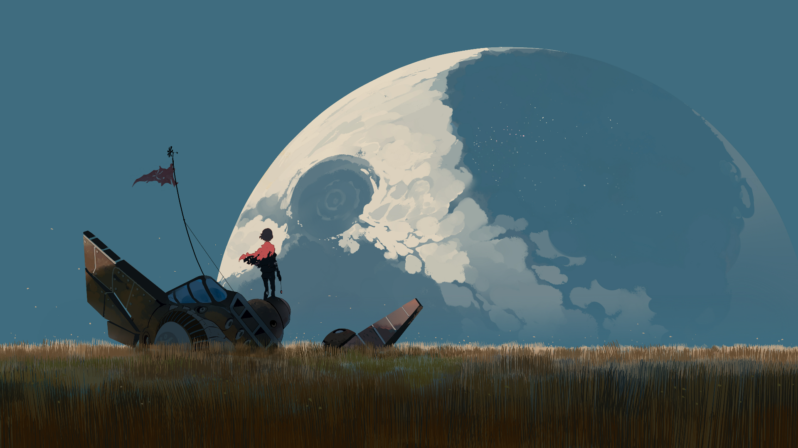
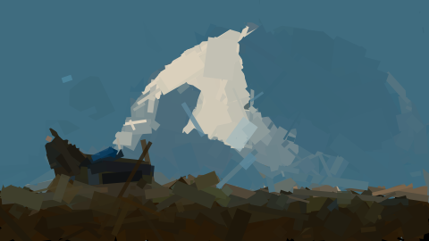

# fun_shapes

Algorithm:
1. Generate Base (Average color of the image)
2. generate *n* random shapes
3. Create *n* new candidate states of the canvas
4. Rank by fitness these candidates and choose the first (eucledian distance)
5. Mutate the new state (only accept mutation if new image is better)
6. Repeat until desired complexity is achieved

This algorithm is ran 3 times, each with a sligtht variation.

- Stage 1: use a faster fitness function that levreages the Monte Carlo technique
- Stage 2: use the standard fitnes function
- Stage 3: add semi-transparent shapes for added smoothness

## Results:

---

# ~~Stuff to do~~

- [x] decide on the language/platform: *js. react native + expo*
- [x] implement sketch of algorithm
- [x] make a demo UI

## Backend

### Image Processing

Functions:
- [x] Fitness function, maybe [delta-e][1] or [root mean square deviation][2]
- [x] Average color

### Image Creation

Structures:
- [x] Shapes (representation of triangles, rectangles, ellipses, etc)
- [x] Canvas with state. (The actual canvas to draw. To be able to resume from a state, or undo actions on the canvas.)

Functions:
- [x] Generate random shape
- [x] Append shape to canvas
- [x] Export canvas to Image (SVG?)

### Variation of Hill Climbing

This hypothetical variation borrows certain things from the genetic algorithms such as a fitness function and mutations.
Hill Climbing was chosen due to it's simplicity and efficiency[1]

Functions:
- [ ] Mutation (Vertex change of a triangle / radius change of an ellipse)

## UI

The React Native app was replaced by a webpage.  
The website receives svg shapes via a websocked and renders them in real time.

---

[1]: http://zschuessler.github.io/DeltaE/learn/
[2]: https://en.wikipedia.org/wiki/Root-mean-square_deviation
[3]: https://sci-hub.st/10.1109/HICSS.1993.284069
